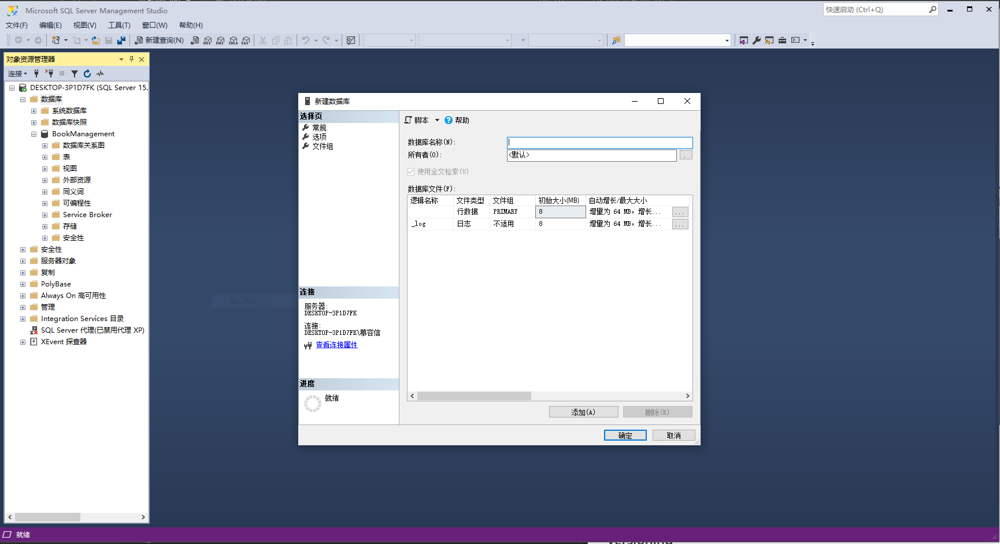
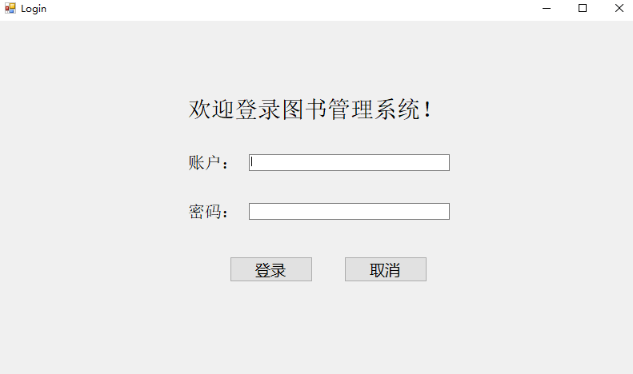
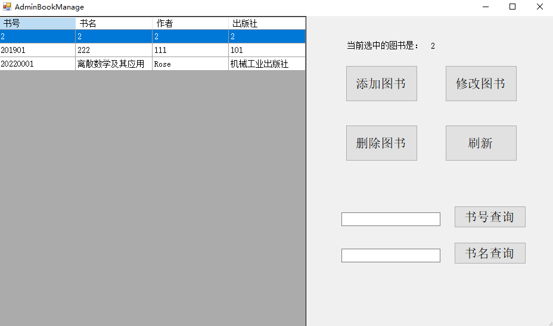
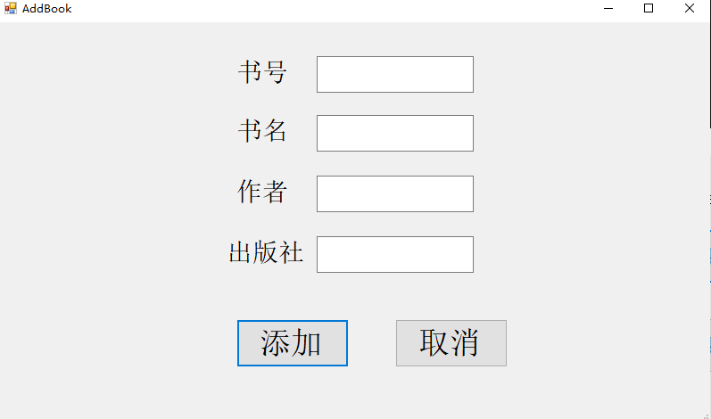
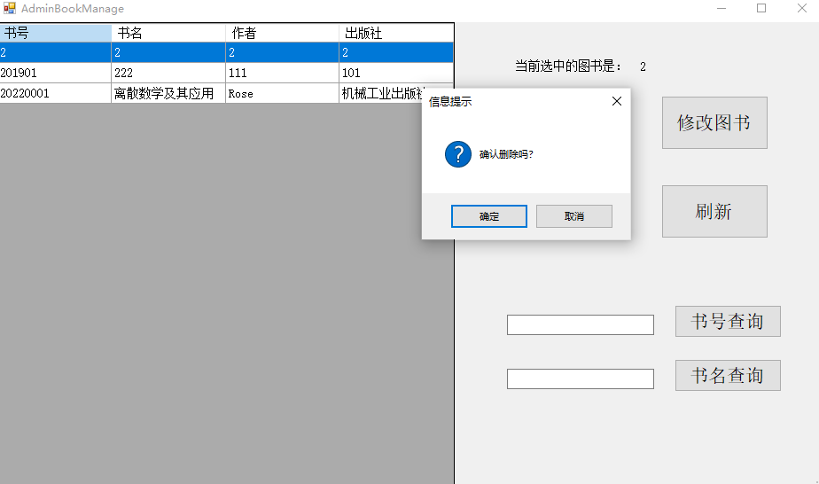
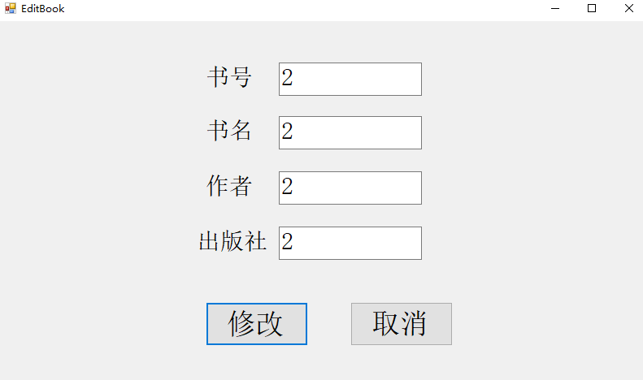
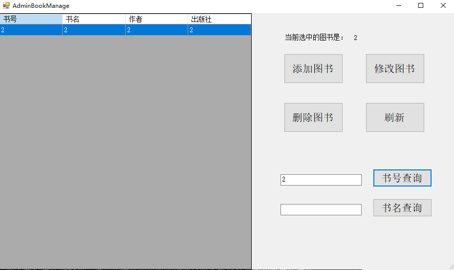
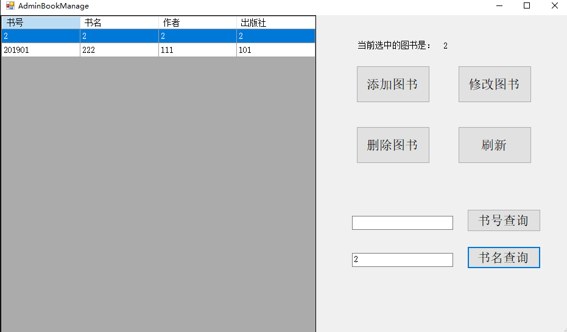

# 个人用图书管理系统

该项目为基于C#的个人用图书管理系统，连接了基于Sql Server的数据库，可以用于个人藏书清点等用途，基本实现了添加图书、修改图书、删除图书和查找图书等操作。

> 如果无法在本地查看该Markdown文件或图片无法顺利加载  
> 请在Github上查看该文件([https://github.com/Only-Don/HUST_SEC2022_Homework](https://github.com/Only-Don/HUST_SEC2022_Homework))  
> 相关源代码也会在课程结束后一并上传至Github上

## 目录
- [个人用图书管理系统](#个人用图书管理系统)
  - [目录](#目录)
  - [Getting Started](#getting-started)
  - [Usage](#usage)
  - [Versioning](#versioning)
  - [Authors](#authors)
  - [License](#license)
  - [Acknowledgments](#acknowledgments)

## Getting Started

* 依赖项：
  * Language：
  * Database：
  * Framework：
  * IDE：
  * Operating System：

* 安装流程：
  1. 准备好上述IDE、数据库、操作系统、语言及运行框架，下载此项目文件夹至本地。
  2. 如Microsoft Visual Studio尚未启动，请启动。
  3. 打开[BookManagement](预习作业/BookManagement/BookManagement.sln)解决方案，它位于项目文件夹下的`/预习作业/BookManagement`文件夹。
  4. 在Microsoft SQL Server Management Studio中登录本地数据库，如已安装并配置Sql server，则服务器名称为本地主机名称，登录后展开左侧对象资源管理器中的本地主机名称，右键单击数据库即可创建新数据库，如图所示：
  
  

  1. 展开已创建好的新数据库，右键单击表，选择`新建`|`表`，创建`t_admin`、`t_book`两张数据表。
     
        > **注意**：由于该代码中Sql语句是基于这两张数据表而运行，故这两张表的名字**不可更改**，若随意更改运行时将报错！
        
  2. 右键单击`t_admin`数据表，选择`编辑前200行`，手动输入管理者的账户与密码，为之后图书管理系统的运行做好准备。
  3. 返回Microsoft Visual Studio，在`调试`菜单中选择`开始调试`，即可试运行该个人用图书管理系统。

## Usage

本项目的使用遵循以下步骤：

1. 打开Microsoft Visual Studio，在`调试`菜单中选择`开始调试`，运行该个人用图书管理系统，界面如图所示：

    

2. 输入与之前在数据库中编辑时一致的账户名称和密码，即可登入图书管理系统，同时弹出**登录成功**提示框；若输入错误，则会弹出**登录失败**提示框；若账户或密码至少有一个为空，则会弹出**用户名和密码不能为空**提示框。
3. 登录成功后，登录界面将隐藏，此时弹出图书管理界面，用户可以在图书管理界面上进行增添、删除、修改、查询图书等操作，如图所示：
   
   

4. 在图书管理系统界面，左侧默认显示所有图书，当鼠标选择左侧一行图书信息时，右侧将显示当前选中图书的信息，方便用户确定是否对该图书进行操作，如果点击`刷新`按钮，则左侧将自动刷新，显示所有图书。

5. 在图书管理系统界面，点击`添加图书`，系统将跳出添加图书界面，如图所示。在添加图书界面可以添加新图书的书号、书名、作者、出版社等信息，若有信息空缺，则会弹出**信息不能为空**提示框。当完成对新图书信息的录入后，点击`添加`按钮，即可添加新图书入库，同时系统将显示**添加成功**的信息，并清空之前的文本信息，等待下一次录入。
   
   若已经完成添加图书操作，则可以点击`取消`按钮，系统将返回到图书管理系统界面。

    

6. 在图书管理系统界面，点击`删除图书`，系统将弹出信息提示，询问是否确认删除，如图所示。若确认删除，则显示**删除成功**提示框，同时自动刷新左侧列表，显示完成删除操作之后的所有图书。

    

7. 在图书管理系统界面，点击`修改图书`，系统将跳出修改图书界面，如图所示。在修改图书界面系统将自动读取要修改图书的所有信息，方便用户修改，当修改完成后，点击`修改`按钮，即可完成修改，若想返回图书管理系统界面，则点击`取消`即可返回。

    

8. 在图书管理系统界面，支持`书号查询`和`书名查询`两种模式。如图所示，`书号查询`为精确查找，只会匹配与输入书号一模一样的图书，而`书名查询`则支持模糊查找，将匹配出现过输入书名信息的所有图书。
   
   

   

   当在使用查询功能时不输入任何信息，此时系统将认为等同于进行一次刷新操作，图书管理系统将在左侧显示所有图书的信息。
   
## Versioning

1.0.0

## Authors

[@Only_Don](https://github.com/Only-Don)

（课程结束后将把源文件上传至Github）

## License

## Acknowledgments
本项目语法部分主要参考《Visual C#从入门到精通（第9版）》，并且特别感谢[@面朝星海我心澎湃](https://space.bilibili.com/124790846)提供的网上教程与在线资料，正是凭借这些内容这个项目的人机交互界面和数据库连接部分才得以完成。可以说，这个项目的诞生与他的帮助密不可分，再次感谢他！